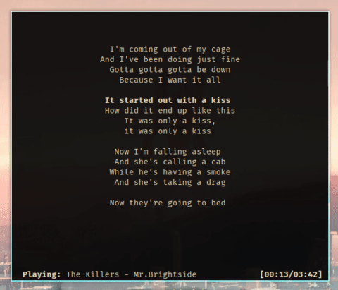

## Introduction
lyrpy is a terminal application to display the lyric of a song played on the `mpd server`. It's based on
`Python3` and `ncurses` and has the ability to highlight the verse that is being singed.



## Requirements

+ GNU Linux as Operative System
+ `mpd` package installed
+ `python3.8` (or greater) and `pip`

## Installation
Clone the repo and run the installer.

	$ git clone https://github.com/its-fonsy/lyrpy
	$ cd lyrpy

To install for evryone

	$ sudo python3 setup.py install

for just you

	$ python3 setup.py install --user

## Usage
Simply run

	$ lyrpy

now the program will look for `.lrc` files that matches the song being played on `mpd` server.

To see how to set the lyrics directory and how to name `lrc` files correctly continue reading.

## Lyrics Directory
The program will search for `.lrc` files into the lyrics directory. The directory can be specified with the
environment variable

	export LYRICS_DIR="/full/path/to/lyrics/dir/"

for example in the `~/.profile` or `~/.bashrc`.

An alternative is to run the program with the flag `-d`

	$ lyrpy -d /full/path/to/lyrics/dir/

**IMPORTANT**: the path must be absolute and end with a `/`.
Things like `~/music/lyric/` or `/media/music/lyric` will not work!

## Lyrics Files
To match the song that is playing on the `mpd server` the files mukst be named:

`ARTIST - TITLE.lrc`

The selection of the lyric file is based on the metadata of the file playing in `mpd`. `lyrpy` show on the
bottom left curner what metadata is seeing (see the image above).

The `.lrc` files must be similar to this

```
[ti:Numb]
[ar:Linkin park]
[length:03:07]

[00:00.00]
[00:21.88]I'm tired of being what you want me to be
[00:25.78]Feeling so faithless, lost under the surface
[00:29.75]
[00:30.55]I don't know what you're expecting of me
[00:34.11]Put under the pressure,
[00:39.02]of walking in your shoes
[00:39.22]Caught in the undertow,
[00:40.22]just caught in the undertow
[00:42.28]Every step that I take
....
```
**Timestamp are required**

For example if you are listening *Numb* by *Linkin Park* the file must be named

	Linkin Park - Numb.lrc


## Problems
+ right now lyrpy doesn't support `offset`, so use lyrics without it
