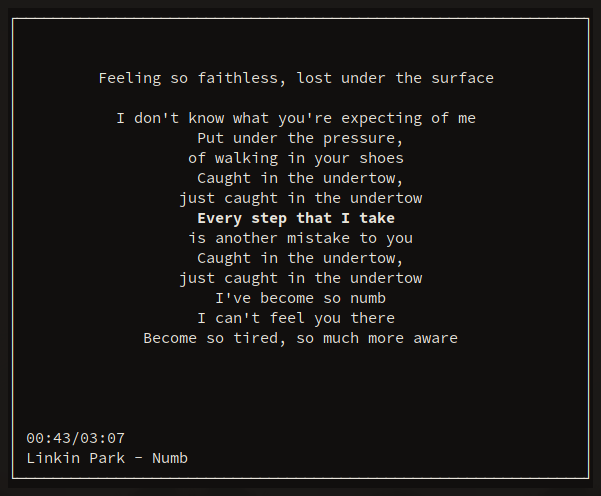

## Introduction
`lyrpy` is a terminal application to display the lyric of a song played on the `mpd server`. It's based on
`Python3` and `ncurses` and has the ability to highlight the verse that is being singed.



## Requirements

+ GNU Linux as Operative System
+ `mpd` package installed
+ `python3.8` (or greater) and `pip`

## Installation
Clone the repo and run the installer.

	$ git clone https://github.com/its-fonsy/lyrpy
	$ cd lyrpy
	$ python3 setup.py install

If it gives error's use the magic word `sudo` on the last comand.

## Usage
Simply run

	$ lyrpy

The folder with all the lyrycs files can be set in the `$HOME/.config/lyrpy/lyrpy.conf` file, or
launching it with the flag

	$ lyrpy -d LYRYCS_DIR

When `lyrpy` is running

+ pressing `q` will quit the program
+ pressing `o` will open the current lyric in a text editor

The text editor can be set in the `lyrpy.conf` or with the flag

	$ lyrpy -e EDITOR

## Lyrics Files
The program will search in the lyrics directory (specified in the `lyrpy.conf` or with the flag `-d`) for
`.lrc` files. To match the song that is playing on the `mpd server` the files must be named:

`ARTIST - TITLE.lrc`

The selection of the lyric file is based on the metadata of the file playing in `mpd`. `lyrpy` show on the
bottom left curner what metadata is seeing (see the image above).

The `.lrc` files must be similar to this

``` text
[ti:Numb]
[ar:Linkin park]
[length:03:07]

[00:00.00]
[00:21.88][02:43.02][02:51.85]I'm tired of being what you want me to be
[00:25.78]Feeling so faithless, lost under the surface
[00:29.75][01:09.84][01:26.88][02:01.83][02:20.36][02:38.46][02:46.60][02:55.54]
[00:30.55]I don't know what you're expecting of me
[00:34.11]Put under the pressure,
[00:39.02]of walking in your shoes
[00:39.22][00:47.78][01:27.10][01:35.40]Caught in the undertow,
[00:40.22][00:51.08][01:28.10][01:36.40]just caught in the undertow
[00:42.28][01:30.13]Every step that I take
....
```
**Timestamp are required**.

Lyrics files can be found on the internet, Google will be your best friend!

## Example
`mpd` is playing _Numb_ by _Linkin Park_. The lyrics directory is set as `~/music/lyrics` via the config
file. To let `lyrpy` work, inside that folder (`~/music/lyrics`), must be `Linkin Park - Numb.lrc`.
