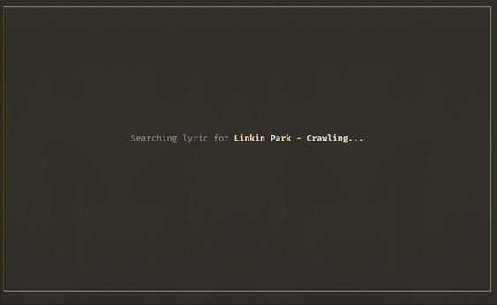
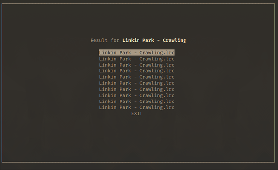
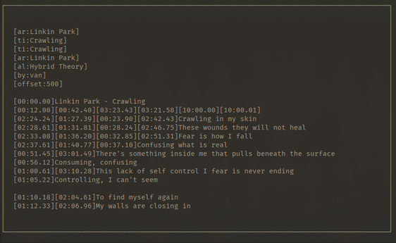

## Introduction
lyrpy is a terminal application to display the lyric of a song played on the `mpd server`. It's based on
`Python3` and `ncurses` and has the ability to highlight the verse that is being singed.


## Requirements

+ GNU Linux as Operative System
+ `mpd` package installed
+ `python3.8` (or greater) and `pip`

## Installation
Clone the repo and run the installer.

	$ git clone https://github.com/its-fonsy/lyrpy
	$ cd lyrpy

To install for evryone

	$ sudo python3 setup.py install

for just you

	$ python3 setup.py install --user

## Usage
Simply run

	$ lyrpy

now the program will look for `.lrc` files that matches the song being played on `mpd` server.

The folder with all the lyrycs files can be set in the `$HOME/.config/lyrpy/lyrpy.conf` file, or
launching it with the flag

	$ lyrpy -d LYRYCS_DIR

## Lyrics Files
The program will search in the lyrics directory (specified in the `lyrpy.conf` or with the flag `-d`) for
`.lrc` files. To match the song that is playing on the `mpd server` the files must be named:

`ARTIST - TITLE.lrc`

The selection of the lyric file is based on the metadata of the file playing in `mpd`. `lyrpy` show on the
bottom left curner what metadata is seeing (see the image above).

The `.lrc` files must be similar to this

```
[ti:Numb]
[ar:Linkin park]
[length:03:07]

[00:00.00]
[00:21.88]I'm tired of being what you want me to be
[00:25.78]Feeling so faithless, lost under the surface
[00:29.75]
[00:30.55]I don't know what you're expecting of me
[00:34.11]Put under the pressure,
[00:39.02]of walking in your shoes
[00:39.22]Caught in the undertow,
[00:40.22]just caught in the undertow
[00:42.28]Every step that I take
....
```
**Timestamp are required**.

For example if you are listening *Numb* by *Linkin Park* the file must be named

	Linkin Park - Numb.lrc

## Keybindings
When `lyrpy` is running

+ pressing `s` will search the lyric of the current song on the internet
+ pressing `o` will open the current lyric in a text editor
+ pressing `q` will quit the program
+ pressing `?` will open a help menu.

The text editor can be set in the `lyrpy.conf` or with the flag

	$ lyrpy -e EDITOR

## The search feature
If you are playing a song that has no lyric you can press `s` and `lyrpy` will search on the internet
if can find something



Then it display what it found



You can choose the result you want with `j` and `k` (or arrow key). Then confirm with `Enter`.



lyrpy show you the lyric selected. You can scroll with `j` and `k`.
If you like it you can save it with `Enter` or exit with `q`.

If you press `Enter` lyrpy will ask to confirm and show where it gonna be saved.

## Problems
+ right now lyrpy doesn't support `offset`, so use lyrics without it
+ sometimes when search for too long a song on the internet it crashes
